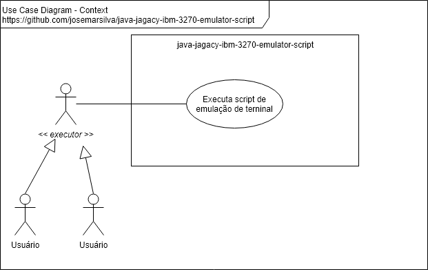
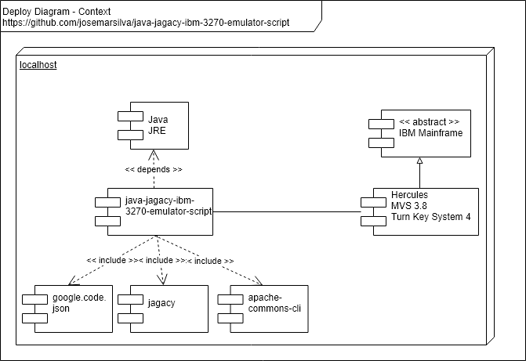

# README - java-jagacy-ibm-3270-emulator-script
Java Jagacy IBM 3270 emulator script

## 1. Introdução
O projeto **java-jagacy-ibm-3270-emulator-script** a execução de um script de comandos em um mainframe, através de uma conexão emulada de um terminal IBM 3270.

## 2. Documentação

### 2.1. Use Case Diagram

 


### 2.2. Deploy Diagram

 


## 3. Projeto

### 3.1. Pré condições

* Java JDK 1.8 (jar file includes runnable)
* Eclipse (version Neon recommended)
* Apache Maven 3.6 (recommended > 3.3)
* `pom.xml`:
  * properties:
    * `<project.build.sourceEncoding>UTF-8</project.build.sourceEncoding>`
  * dependencies:
    * `<!-- https://mvnrepository.com/artifact/commons-cli/commons-cli -->`
    * `<!-- https://mvnrepository.com/artifact/org.apache.maven.plugins/maven-dependency-plugin -->`
    * `<!-- https://mvnrepository.com/artifact/com.google.code.gson/gson -->`
  * build:
    * `<finalName>java-jagacy-ibm-3270-emulator-script</finalName>`
	* `<plugin> <artifactId>maven-assembly-plugin</artifactId> </plugin>`


### 3.2. Guia para Desenvolvedor (Developers Guide)

* Clone source code using "git clone". Use branch "master" if branch "develop" is not available.
* Read, if avaliable, "2. Documentation"  and "3.X. Guides, Patterns, Standard, Conventions and Best Practices" to understand patterns, standards, conventions and best practices used in this project.
* Make your changes, commit and push on "develop" branch. Use branch "master" if branch "develop" is not available. Ask me permission, if not available permission to push.


### 3.3. Guia de Configuração (Configuration Guide)

* Passo 1: Instalando a biblioteca do Jagacy no repositório local

```cmd
mvn install:install-file -Dfile=jagacy3270.jar -DgroupId=jagacy3270 -DartifactId=jagacy3270 -Dversion=4.2.3 -Dpackaging=jar
```

* Passo 2: Configuração da JRE 1.8 do Eclipse. Clique na pasta `JRE System Library [XXXX]` em seguida com botão invertido do mouse configure a JRE 1.8
```cmd
JavaSE-1.8(jre1.8.0_191)
```

### 3.4. Guia para Implantação (Deploy Guide)

The following command line builds a runnable (.jar) in `.\target\java-simplecalc-cli-jar-with-dependencies.jar`

```bat
C:\..\java-jagacy-ibm-3270-emulator-script> mvn clean compile package assembly:single
```


### 3.5. Guia de Demonstração (Demonstration Guide)

* Pré-condições:
  * [Mainframe Hercules disponível](https://github.com/josemarsilva/eval-hercules-mvs-3.8-turnkey-4-system)

* Passo 1: Help em linha de comando
   
```bat
C:\..\java-jagacy-ibm-3270-emulator-script> java -jar .\target\java-jagacy-ibm-3270-emulator-script
2 
```


### 3.7. Patterns, Standard, Conventions and Best Practices

* n/a


## I - References

* https://github.com/josemarsilva/eval-hercules-mvs-3.8-turnkey-4-system
* https://github.com/upgundecha/jagacy-cucumber-bdd-example
